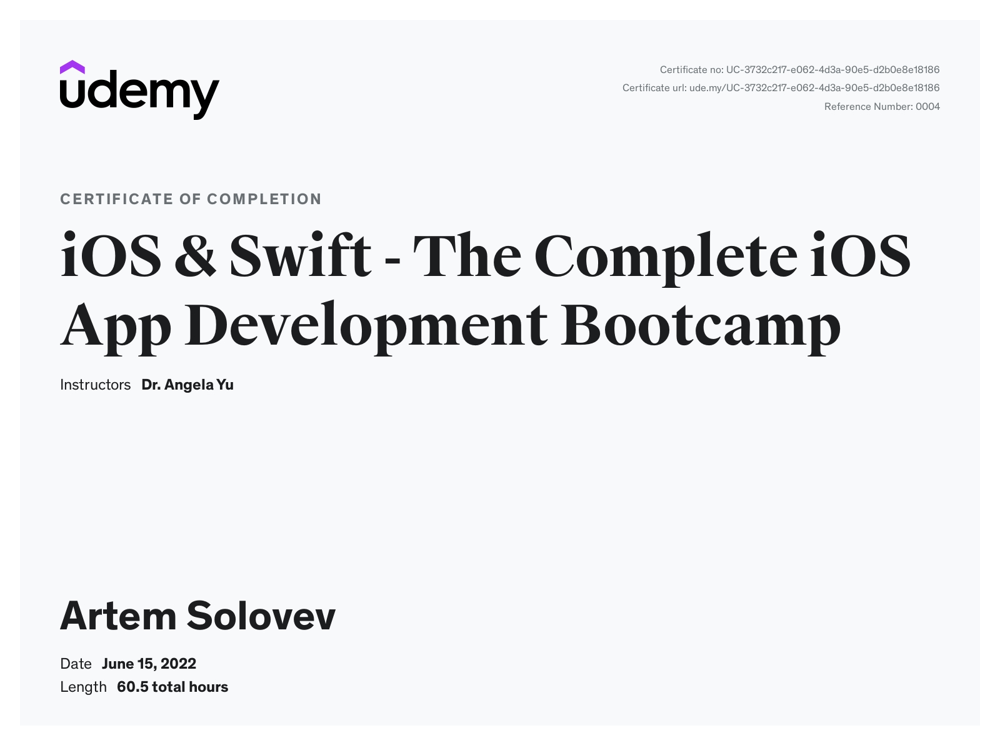

# Курс Udemy: iOS & Swift - The Complete iOS App Development Bootcamp
www.udemy.com/course/ios-13-app-development-bootcamp/

В ходе прохождения курса мной были изучены следующие технологии:
- Язык программирования Swift
- Работа со Storyboard и Inteface Builder
- Фреймворк UIKit
- Паттерны проектирования MVC, Singleton
- Работа с сетью, JSON Parsing, APIs
- Менеджер зависимостей CocoaPods
- Система контроля версия Git и веб-сервис GitHub
- Хранение данных в: User Defaults, Core Data and Realm

## Certificate:

